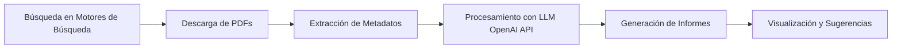

# Go Fear the Foca


**Go Fear the Foca** es una herramienta de código abierto desarrollada en Go que busca archivos PDF en línea de una empresa específica, extrae todos sus metadatos y los procesa utilizando modelos de lenguaje (LLM) a través de la API de OpenAI. El objetivo es ayudar a las empresas a detectar posibles fugas de información y mejorar su seguridad.

## Índice

- [Características](#características)
- [Arquitectura del Proyecto](#arquitectura-del-proyecto)
- [Requisitos Previos](#requisitos-previos)
- [Instalación](#instalación)
- [Uso](#uso)
- [Consideraciones Éticas y Legales](#consideraciones-éticas-y-legales)
- [Contribuciones](#contribuciones)
- [Licencia](#licencia)

## Características

- **Búsqueda en Línea de PDFs**: Utiliza APIs de motores de búsqueda para encontrar archivos PDF relacionados con una empresa.
- **Extracción de Metadatos**: Extrae todos los metadatos disponibles de los archivos PDF encontrados.
- **Análisis con LLM**: Procesa los metadatos utilizando la API de OpenAI para generar informes y sugerencias de soluciones o posibles vectores de ataque.
- **Generación de Informes**: Crea informes detallados en formatos como HTML o PDF.
- **Visualización**: Incluye gráficos y tablas para facilitar la interpretación de los datos.

## Arquitectura del Proyecto



## Requisitos Previos

- **Go**: Versión 1.16 o superior.
- **Clave de API de OpenAI**: Necesaria para acceder al modelo de lenguaje.
- **Credenciales de Motores de Búsqueda**: Para utilizar las APIs de búsqueda (por ejemplo, Google Custom Search API, Bing Search API).

## Instalación

1. **Clonar el Repositorio**

```bash
git clone https://github.com/tu_usuario/go-fear-the-foca.git
cd go-fear-the-foca
```

2. **Instalar Dependencias**

```bash
go mod download
```

3. **Configurar Variables de Entorno**

Asegúrate de configurar las siguientes variables de entorno:

- `OPENAI_API_KEY`: Tu clave de API de OpenAI.
- `SEARCH_ENGINE_API_KEY`: Clave de API del motor de búsqueda que utilizarás.
- `SEARCH_ENGINE_ID`: ID del motor de búsqueda personalizado (si aplica).

## Uso

Puedes compilar y ejecutar la aplicación utilizando el `Makefile`:

```bash
# Instalar dependencias
make install

# Compilar la aplicación
make build

# Ejecutar la aplicación con argumentos
make run ARGS="-domain ejemplo.com"

# Limpiar archivos binarios
make clean

# Ejecutar pruebas unitarias
make test

# Ejecutar linter
make lint

# Formatear el código
make fmt
```

### Parámetros Opcionales

- `-output`: Directorio donde se guardarán los informes generados.
- `-format`: Formato del informe (`html`, `pdf`, `json`).

## Consideraciones Éticas y Legales

**Go Fear the Foca** está diseñado para ser utilizado con fines de seguridad y mejora de prácticas corporativas. Es crucial obtener el consentimiento explícito de la empresa antes de realizar cualquier análisis.

- **Uso Responsable**: No utilices esta herramienta para actividades maliciosas o no autorizadas.
- **Privacidad**: Respeta las leyes y regulaciones de protección de datos aplicables.

## Contribuciones

¡Las contribuciones son bienvenidas! Por favor, abre un issue o pull request para sugerir mejoras o reportar problemas.

## Licencia

Este proyecto está bajo la Licencia MIT.
